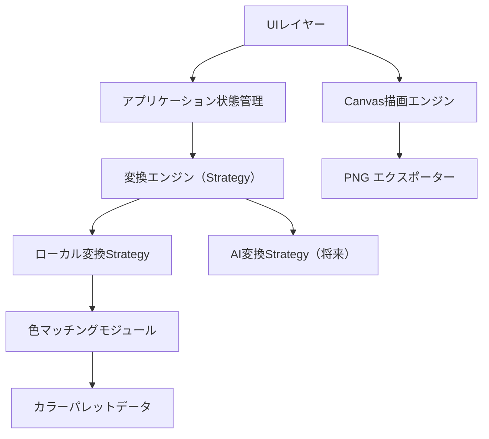
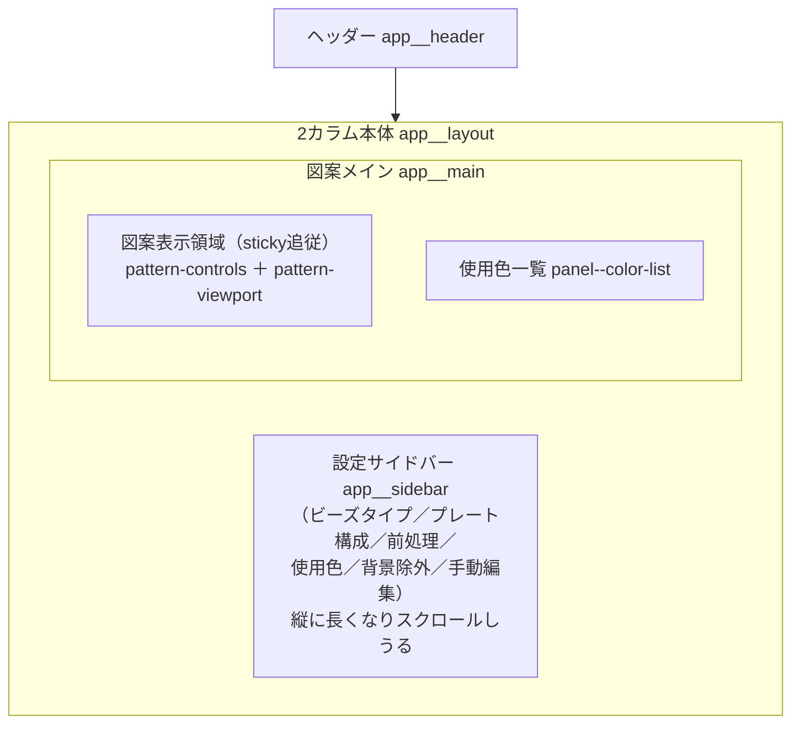
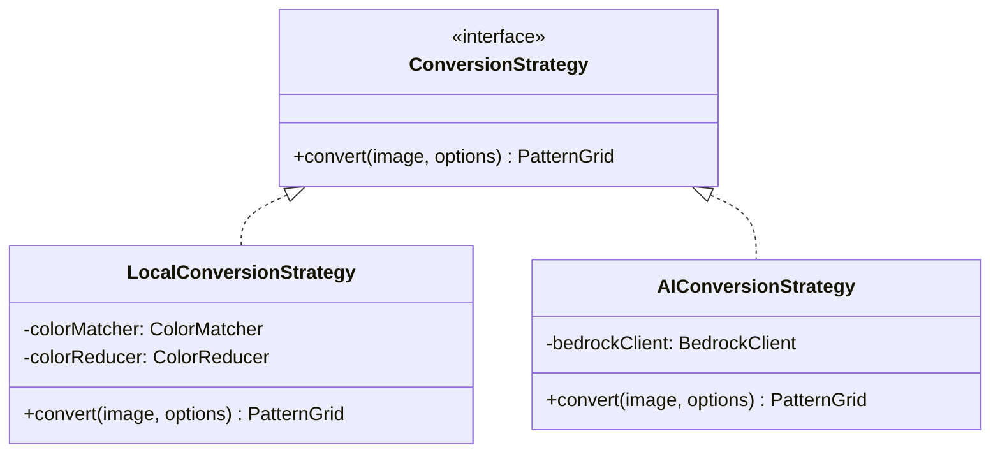
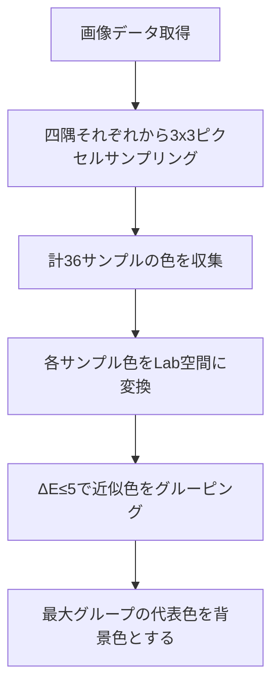
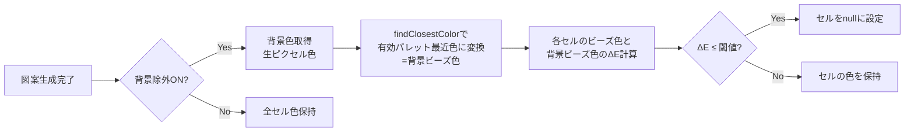

# 技術設計書: Bead Pattern Maker

## 概要

本ドキュメントは、アイロンビーズ図案自動生成Webアプリケーション「Bead Pattern Maker」の技術設計を定義する。ユーザーがアップロードした画像を、選択したビーズタイプ（パーラービーズ/ナノビーズ）のカラーパレットに基づいてドット絵風の図案に変換し、Canvas上にグリッド表示・PNG画像としてエクスポートする機能を提供する。

### 技術スタック

- **ビルドツール**: Vite 8.x
- **言語**: Vanilla JavaScript（ESモジュール）
- **レンダリング**: HTML5 Canvas API
- **テスト**: Vitest + fast-check（プロパティベーステスト）
- **スタイリング**: CSS（フレームワークなし）

### 設計方針

- クライアントサイド完結（バックエンドなし）
- Strategy パターンによる変換エンジンの交換可能設計
- モジュール分離によるテスタビリティ確保
- 将来的なAI変換エンジン（Amazon Bedrock）統合を見据えた拡張性

---

## アーキテクチャ

### 全体構成



### レイヤー構成

| レイヤー | 責務 | モジュール |
|---------|------|-----------|
| UIレイヤー | ユーザー操作の受付、DOM操作 | `ui/` 配下 |
| 状態管理 | アプリケーション状態の一元管理 | `state.js` |
| ビジネスロジック | 図案生成、色変換 | `engine/` 配下 |
| データ | カラーパレット定義 | `data/` 配下 |
| 描画 | Canvas描画、エクスポート | `renderer/` 配下 |

### ファイル構成

```
src/
├── main.js                    # エントリポイント、アプリ初期化
├── state.js                   # アプリケーション状態管理
├── engine/
│   ├── ConversionStrategy.js  # Strategy インターフェース定義
│   ├── LocalConversionStrategy.js  # ローカル変換実装
│   ├── colorMatcher.js        # CIE76色差計算・最近色検索
│   ├── colorReducer.js        # 減色（色量子化, median cut等）処理
│   ├── imageProcessor.js      # 画像リサイズ・ピクセル抽出（フィットモード＋リサイズ方式の適用）
│   └── backgroundDetector.js  # 背景色自動検出・閾値ベースマッチング
├── renderer/
│   ├── canvasRenderer.js      # Canvas描画（グリッド、ビーズ、ハッチング）
│   └── exporter.js            # PNG画像エクスポート
├── data/
│   ├── parlerPalette.js       # パーラービーズカラーパレット
│   └── nanoPalette.js         # ナノビーズカラーパレット
├── ui/
│   ├── imageUpload.js         # 画像アップロードUI
│   ├── beadTypeSelector.js    # ビーズタイプ選択UI
│   ├── plateConfig.js         # プレート構成設定UI
│   ├── recommendedSizes.js    # おすすめサイズ表示UI
│   ├── colorList.js           # 使用色一覧UI
│   ├── paletteSelector.js     # 使用パレット選択UI（色の有効/無効、最大色数）
│   ├── patternEditor.js       # 図案手動編集UI（色/消しゴム選択、セルクリック塗り）
│   └── backgroundExclusion.js # 背景除外UI（トグル、閾値スライダー、クリック選択）
├── utils/
│   └── colorUtils.js          # RGB⇔Lab変換ユーティリティ
└── style.css                  # スタイル定義
```

### UIレイアウト設計（操作レイアウトと図案の常時視認性）

設定パネルを操作・スクロールしても、生成中の図案が常に画面内に見え続けるようにするためのレイアウト設計を定義する（要件13）。本設計はCSS（`position: sticky` とメディアクエリ）と既存DOM構造の調整のみで実現し、JavaScript側のデータフロー・状態管理には影響しない。

#### レイアウト構造

アプリ全体は「ヘッダー」＋「2カラム本体（設定サイドバー｜図案メイン）」で構成する。図案メイン（`app__main`）には、ズーム／エクスポート操作（`pattern-controls`）・メッセージ・図案ビューポート（`pattern-viewport`）・使用色一覧を縦に積む。



#### sticky による図案の常時視認（要件13.1, 13.2）

- 図案表示領域（ズーム／エクスポート操作 `pattern-controls` と図案ビューポート `pattern-viewport` をまとめたブロック）を `position: sticky; top: <ヘッダー下の余白>` で画面上端に追従させる。
- これにより、設定サイドバーが縦に長くなりページ全体をスクロールしても、図案表示領域はビューポート内に留まり続け、図案を確認するためにサイドバー先頭へ戻る操作が不要になる（要件13.2）。設定パネルと図案を同時に視認できる（要件13.1）。
- 既存の `pattern-viewport` は `max-height: 70vh` ＋ `overflow: auto` を維持し、図案自体が大きい場合は領域内スクロールで全体を閲覧できる（要件5.3）。sticky による追従と、ビューポート内スクロールは独立して機能する。

#### 設定変更の即時反映（要件13.3）

設定値（色の有効・無効、背景除外、リサイズ方式、フィットモード、最大色数など）の変更は、既存の再生成フロー（各UIコールバック → `generatePattern` → `state.setPattern` → `renderView`）で図案へ反映される。図案表示領域が sticky で画面内に留まるため、スクロール操作なしに更新後の図案を確認できる。レイアウト変更は表示位置の制御のみを担い、既存のデータフローには手を加えない。

#### レスポンシブ（要件13.4）

- 狭幅ビューポート（幅768ピクセル以下のモバイル・タブレット相当）では、2カラムを縦積みに再構成する。
- 縦積み時は図案表示領域を画面の上部（または下部）に `position: sticky` で固定し、設定パネルを操作・スクロールしている間も図案を視認できる状態を維持する（要件13.4）。
- **ブレークポイントの整合（重要）:** 現状の `style.css` は2カラム→縦積みの切り替えを `max-width: 900px` で行っているが、要件13.4は768ピクセル以下を「狭幅」と定義する。本設計では、縦積み＋図案 sticky 固定へ切り替える基準ブレークポイントを要件に合わせて **768px** に統一する。900px〜769px の中間幅では2カラムのままサイドバー幅が縮む挙動を許容し、768px 以下で縦積み＋図案上部 sticky へ切り替える。既存の 900px ブレークポイントは、768px へ寄せて統一するか、中間幅向けの段階的なレイアウト調整として残すかをスタイル実装時に確定する。

| 対象要素 | デスクトップ幅（> 768px） | 狭幅（≤ 768px） |
|---------|--------------------------|-----------------|
| `app__layout` | 横並び2カラム（サイドバー｜図案メイン） | 縦積み（1カラム） |
| 図案表示領域（`pattern-controls` ＋ `pattern-viewport`） | `position: sticky; top: …` で上端追従 | 画面上部（または下部）に `position: sticky` で固定 |
| `app__sidebar` | 固定幅・縦スクロール可 | 全幅・図案の下（または上）に配置 |

> **注:** 本レイアウト設計は要件13専用のUI調整であり、入力に応じて振る舞いが変化する性質を持たない（CSSレイアウト挙動）。したがって正当性プロパティ（プロパティベーステスト）の対象外とし、検証は手動・レスポンシブテストで行う（テスト戦略参照）。

---

## コンポーネントとインターフェース

### 1. 変換エンジン（Strategy パターン）

変換エンジンはStrategy パターンで実装し、アルゴリズムの交換を容易にする。



#### ConversionStrategy インターフェース

```javascript
/**
 * 変換Strategyインターフェース
 * @typedef {Object} ConversionStrategy
 * @property {function(HTMLImageElement, ConversionOptions): PatternGrid} convert
 */

/**
 * @param {HTMLImageElement} image - アップロードされた元画像（リサイズ前）
 * @param {ConversionOptions} options - 変換オプション
 * @returns {PatternGrid} 生成された図案グリッド
 */

/**
 * @typedef {Object} ConversionOptions
 * @property {number} width - 図案の横ビーズ数（cols × pegCount）
 * @property {number} height - 図案の縦ビーズ数（rows × pegCount）
 * @property {BeadColor[]} activePalette - 使用パレット（無効化色を除いた有効色のみ）
 * @property {'smooth' | 'sharp'} resizeMethod - リサイズ方式（要件10）
 * @property {'stretch' | 'contain' | 'cover'} fitMode - フィットモード（要件10）
 * @property {number | null} maxColors - 最大色数（nullは制限なし、要件11）
 */
```

#### LocalConversionStrategy

`convert` は以下のパイプライン順序で図案を生成する（要件4・10・11）:

1. **フィット／リサイズ**: `imageProcessor.resizeImage` で元画像を図案サイズ（`width × height`）にリサイズする。このとき `fitMode` と `resizeMethod` を適用する。`contain` の余白領域は完全透明ピクセル（alpha=0）として出力される。結果は `ImageData`。
2. **透明判定と白合成**: 各ピクセルについて、`alpha < 128` のピクセルは未配置（`null`）セルとしてマークする。`alpha >= 128` のピクセルは白背景（RGB 255, 255, 255）に合成して不透明RGBを得る（要件4.6, 4.7）。
3. **減色（任意）**: `maxColors` が指定されている場合、不透明ピクセルの集合に対して `colorReducer.reduceColors` を実行し、`maxColors` 以下の代表色に量子化する（要件11.4）。`maxColors` が `null`（制限なし）の場合はこのステップをスキップする。
4. **最近色マッチング**: 各（減色後の）ピクセル色を、`activePalette`（無効化色を除外した有効色）の中から CIE76 色差で最も近い色にマッピングする（要件4.2, 4.3, 11.2）。
5. **背景除外（任意）**: 背景除外が有効な場合、背景色に該当するセルを `null` に設定する（既存フロー、要件9）。
6. `PatternGrid` を生成して返却する。`cells` は背景除外適用後、`originalCells` は背景除外適用前（ステップ4完了時点）のグリッドを保持する。

> **注**: ステップ2の「透明ピクセル → 未配置」変換は、背景除外トグルのオン・オフとは独立して常に適用される。つまり `contain` の余白やもともと透明な領域は、背景除外がオフであっても未配置セルになる。

### 2. 色マッチングモジュール（colorMatcher.js）

#### CIE76色差計算アルゴリズム

RGB色空間からCIE Lab色空間に変換し、ユークリッド距離で色差を計算する。

```
ΔE = √((L₁-L₂)² + (a₁-a₂)² + (b₁-b₂)²)
```

**変換フロー:**
1. RGB → sRGB（リニア化）: ガンマ補正の除去
2. sRGB → XYZ: マトリクス変換
3. XYZ → Lab: 非線形変換（D65白色点基準）

```javascript
/**
 * RGB色をLab色空間に変換する
 * @param {number} r - 赤 (0-255)
 * @param {number} g - 緑 (0-255)
 * @param {number} b - 青 (0-255)
 * @returns {{L: number, a: number, b: number}}
 */
function rgbToLab(r, g, b) { ... }

/**
 * 2色間のCIE76色差を計算する
 * @param {{L: number, a: number, b: number}} lab1
 * @param {{L: number, a: number, b: number}} lab2
 * @returns {number} ΔE値
 */
function deltaE(lab1, lab2) { ... }

/**
 * パレットから最も近い色を検索する
 * @param {{r: number, g: number, b: number}} targetColor - 対象色
 * @param {BeadColor[]} palette - カラーパレット
 * @returns {BeadColor} 最近色
 */
function findClosestColor(targetColor, palette) { ... }
```

### 3. 画像処理モジュール（imageProcessor.js）

```javascript
/**
 * 画像をCanvas経由で指定サイズにリサイズしImageDataを返す
 * リサイズ方式（補間方法）とフィットモード（アスペクト比の合わせ方）を適用する
 * @param {HTMLImageElement} image - アップロードされた画像
 * @param {number} targetWidth - 目標幅（ビーズ数 = cols × pegCount）
 * @param {number} targetHeight - 目標高さ（ビーズ数 = rows × pegCount）
 * @param {ResizeOptions} options - リサイズ方式・フィットモード
 * @returns {ImageData} リサイズ済み画像データ
 */
function resizeImage(image, targetWidth, targetHeight, options) { ... }

/**
 * @typedef {Object} ResizeOptions
 * @property {'smooth' | 'sharp'} resizeMethod - リサイズ方式（要件10）
 * @property {'stretch' | 'contain' | 'cover'} fitMode - フィットモード（要件10）
 */
```

**処理概要:**

- オフスクリーンCanvasを `targetWidth × targetHeight` で生成する
- **描画前に必ずCanvas全体を透明（alpha=0）でクリアする**（`clearRect`）。これにより `contain` の余白が透明ピクセルとして残り、下流で未配置セルになる
- リサイズ方式・フィットモードに応じてコンテキスト設定と `drawImage` の描画矩形を切り替える
- `getImageData` でピクセルデータを取得して返す

**リサイズ方式（resizeMethod）による補間制御:**

| 方式 | コンテキスト設定 | 効果 |
|------|----------------|------|
| `smooth`（なめらか） | `ctx.imageSmoothingEnabled = true` / `ctx.imageSmoothingQuality = 'high'` | ピクセル色を平均化し、写真向きのなめらかな縮小（要件10.2） |
| `sharp`（くっきり） | `ctx.imageSmoothingEnabled = false` | 最近傍補間でエッジの色を保持し、ドット絵向きのくっきりした縮小（要件10.3） |

**フィットモード（fitMode）による描画矩形制御:**

`drawImage(image, dx, dy, dWidth, dHeight)` の描画先矩形（およびクロップ時の転送元矩形）を以下のように決定する。`s = 元画像`、`t = ターゲット` とする。

| モード | アスペクト比 | 描画方法 |
|--------|------------|---------|
| `stretch`（伸縮） | 無視 | ターゲット全体を埋めるように描画（`dx=0, dy=0, dWidth=targetWidth, dHeight=targetHeight`）。要件10.5 |
| `contain`（フィット） | 維持 | `scale = min(targetWidth/s.width, targetHeight/s.height)` で縮小し、中央寄せで配置。余白（レターボックス領域）はクリア済みの透明ピクセルのまま残り、下流で未配置セルになる。要件10.6 |
| `cover`（クロップ） | 維持 | `scale = max(targetWidth/s.width, targetHeight/s.height)` で拡大し、中央寄せで配置。ターゲットからはみ出した領域は切り取られる（描画矩形がターゲット外に出ることで自然にクリップされる）。要件10.7 |

**重要:** いずれのフィットモードでも、出力 `ImageData` の寸法は常に `targetWidth × targetHeight` で一定である。フィットモードは「画像をどう収めるか」を変えるだけで、グリッド寸法そのものは変えない。`contain` のみ、収まらない領域が透明＝未配置として表現される。

### 4. Canvas描画エンジン（canvasRenderer.js）

```javascript
/**
 * 図案をCanvasに描画する
 * @param {HTMLCanvasElement} canvas - 描画先Canvas
 * @param {PatternGrid} pattern - 図案データ
 * @param {RenderOptions} options - 描画オプション
 */
function renderPattern(canvas, pattern, options) { ... }

/**
 * 未配置セル（null）にハッチングパターンを描画する
 * @param {CanvasRenderingContext2D} ctx - Canvas 2Dコンテキスト
 * @param {number} x - セルのX座標（ピクセル）
 * @param {number} y - セルのY座標（ピクセル）
 * @param {number} size - セルのサイズ（ピクセル）
 */
function renderHatchedCell(ctx, x, y, size) { ... }
```

**描画要素:**
- ビーズセル: 対応色で塗りつぶし
- 未配置セル（null）: 白背景に薄いグレー（#ccc）の対角線ハッチングパターン（左上→右下方向、3px間隔）
- セル境界線: 薄いグリッド線（1px, #ccc）
- プレート境界線: 太いグリッド線（2px, #333）

**ハッチング描画仕様:**
- 背景色: 白（#ffffff）
- 対角線色: 薄いグレー（#cccccc）
- 対角線幅: 1px
- 対角線間隔: 3px
- 方向: 左上から右下（45度）

**ズーム対応:**
- `options.zoom`（0.5〜4.0）でセルサイズを可変
- Canvas自体のサイズを動的に変更

### 5. エクスポーター（exporter.js）

```javascript
/**
 * 図案をPNG画像として生成しダウンロードする
 * @param {PatternGrid} pattern - 図案データ
 * @param {BeadColor[]} usedColors - 使用色一覧
 * @param {ExportOptions} options - エクスポートオプション
 */
function exportAsPng(pattern, usedColors, options) { ... }
```

- オフスクリーンCanvasに図案を描画（セルサイズ20px以上）
- 未配置セル（null）はハッチングパターンで描画（canvasRenderer同様）
- 図案下部に使用色一覧を追加描画（未配置セルは使用色一覧に含めない）
- `canvas.toBlob()`でBlobを生成
- `URL.createObjectURL()`とダウンロードリンクでファイル保存

### 6. 背景検出モジュール（backgroundDetector.js）

背景色の自動検出とΔE閾値に基づくセル除外を行うモジュール。

```javascript
/**
 * 画像の四隅からピクセルをサンプリングし、最も頻度の高い色を背景色として検出する
 * 各コーナーから3x3ピクセル（計36サンプル）を取得し、エッジアーティファクトを回避する
 * @param {ImageData} imageData - 画像データ
 * @param {number} width - 画像の幅
 * @param {number} height - 画像の高さ
 * @returns {{r: number, g: number, b: number}} 検出された背景色
 */
function detectBackgroundColor(imageData, width, height) { ... }

/**
 * 指定色が背景色のΔE閾値以内かどうかを判定する
 * @param {{r: number, g: number, b: number}} pixelColor - 判定対象の色
 * @param {{r: number, g: number, b: number}} backgroundColor - 背景色
 * @param {number} threshold - ΔE閾値 (0-50)
 * @returns {boolean} 背景色と見なす場合true
 */
function isBackgroundColor(pixelColor, backgroundColor, threshold) { ... }

/**
 * 図案グリッドに背景除外を適用し、背景色に該当するセルをnullに設定する
 * @param {PatternGrid} pattern - 対象の図案グリッド
 * @param {{r: number, g: number, b: number}} backgroundColor - 背景色
 * @param {number} threshold - ΔE閾値
 * @returns {PatternGrid} 背景除外適用済みグリッド（新規オブジェクト）
 */
function applyBackgroundExclusion(pattern, backgroundColor, threshold) { ... }
```

**背景自動検出アルゴリズム:**



- コーナーサンプリング位置: 各コーナーから内側に2〜4ピクセルの範囲で3x3ピクセルを取得
- 色のグルーピング: 近似色（ΔE≤5）を同一グループとして扱い、最も多いグループの中心色を背景色候補とする
- エッジケース: 4コーナーが全て異なる色の場合は最も頻度の高いグループの代表色を返す

**背景除外のデータフロー:**



**色空間の整合性（重要・要件9.2）:**

背景判定は**ビーズ色空間**（パレット内の色）で一貫して行う必要がある。背景色の入力は2経路あり、いずれも生のピクセル色なので、比較前に有効パレットの最近色へ変換する:

- **手動選択**: `pickColorFromPreview` はプレビュー画像の**生ピクセル色**（RAW RGB）を返す。背景除外はパレットマッチングの**後**（ビーズ色に対して）適用されるため、この生の色を `findClosestColor` で有効パレット内の最近色に変換し、「背景ビーズ色」を得る。
- **自動検出**: `detectBackgroundColor` が返す四隅の代表色も生ピクセル色なので、同様に `findClosestColor` で有効パレットの最近色に変換してから比較に用いる。
- **比較**: 除外判定は、各セルの**ビーズ色**と「背景ビーズ色」の間でΔEを計算する。これにより、生ピクセル色とビーズ色という異なる色空間を比較してしまう不整合（色空間ミスマッチ）を防ぐ。

**処理順序（重要）:**

背景除外は色変換の**後**に実行される:
1. 画像をフィット／リサイズ
2. 各ピクセルを有効パレット内の最近色に変換（既存フロー）
3. 背景色（生ピクセル色）を `findClosestColor` で有効パレットの最近色に変換し「背景ビーズ色」を得る
4. 背景除外が有効な場合、各セルのビーズ色と背景ビーズ色のΔEを計算して背景判定を適用
5. 背景色に該当するセルを `null` に設定

この順序により、背景検出・比較はともにパレット内のビーズ色空間で行われる。これにより予測可能性が向上し、パレット色空間での閾値設定が直感的になる。

### 7. おすすめサイズ計算

```javascript
/**
 * 画像の解像度とアスペクト比から推奨プレート構成を計算する
 * @param {number} imageWidth - 画像の幅
 * @param {number} imageHeight - 画像の高さ
 * @param {number} pegCount - 1プレートあたりのペグ数（29 or 28）
 * @returns {RecommendedSize[]} 推奨サイズ一覧（最大3件）
 */
function calculateRecommendedSizes(imageWidth, imageHeight, pegCount) { ... }
```

**アルゴリズム:**
1. 画像のアスペクト比を算出: `aspectRatio = width / height`
2. 1x1〜10x10の全プレート構成を候補として列挙
3. 各候補のアスペクト比との差分を計算: `|candidateAspect - imageAspect|`
4. アスペクト比の差分が小さい順にソート
5. 上位3件（画像が小さい場合は1x1のみ）を返却

### 8. 背景除外UIコンポーネント（backgroundExclusion.js）

背景除外の設定UIを管理するコンポーネント。

```javascript
/**
 * 背景除外UIを初期化する
 * @param {HTMLElement} container - UIコンテナ要素
 * @param {AppState} state - アプリケーション状態
 * @param {function} onSettingsChange - 設定変更時のコールバック
 */
function initBackgroundExclusionUI(container, state, onSettingsChange) { ... }

/**
 * 画像プレビューのクリックイベントから背景色を手動選択する
 * @param {HTMLCanvasElement} previewCanvas - プレビューCanvas
 * @param {MouseEvent} event - クリックイベント
 * @returns {{r: number, g: number, b: number}} クリック位置の生ピクセル色（RAW RGB）
 */
function pickColorFromPreview(previewCanvas, event) { ... }
```

> **色空間の注意（要件9.2）:** `pickColorFromPreview` および自動検出が返すのは**生ピクセル色**であり、背景除外で比較するビーズ色空間とは異なる。背景判定の前に必ず `findClosestColor` で有効パレットの最近色（背景ビーズ色）に変換すること。詳細は「6. 背景検出モジュール」の色空間整合性を参照。

**UI構成:**

```
┌─────────────────────────────────────────┐
│ 背景除外  [OFF/ON トグル]                │
├─────────────────────────────────────────┤
│ （ONの場合のみ以下を表示）                │
│                                         │
│ 背景色: [■ カラースウォッチ]             │
│         (自動検出 / 画像クリックで変更)    │
│                                         │
│ ΔE閾値: [━━━━●━━━━━] 10               │
│          0              50              │
│                                         │
│ 除外セル: 156個 (18.5%)                  │
└─────────────────────────────────────────┘
```

**操作フロー:**
1. トグルをONにすると、自動的に四隅サンプリングで背景色を検出
2. 検出結果のカラースウォッチを表示
3. ユーザーが画像プレビュー上をクリックすると、その位置の色で背景色を上書き
4. ΔEスライダーを調整すると、リアルタイムで除外対象セル数が更新
5. 設定変更のたびに`onSettingsChange`コールバックを発火し、図案を再描画

### 9. 使用色一覧（colorList.js）の更新

背景除外機能に対応するため、以下の変更を行う:

```javascript
/**
 * 使用色一覧を計算する（nullセルを除外）
 * @param {PatternGrid} pattern - 図案データ
 * @returns {{colors: UsedColorEntry[], totalBeads: number, excludedCount: number}}
 */
function calculateUsedColors(pattern) { ... }
```

**変更点:**
- `cells` 配列内の `null` セルをフィルタリングしてからカウント
- 合計ビーズ数は `null` を除いたセル数
- 未配置セル数と割合を別途算出:「未配置: X個 (Y%)」として表示
- 未配置情報は色一覧の外（上部または下部）に独立して表示

### 10. 減色モジュール（colorReducer.js）

最大色数が指定された場合に、画像の代表色を抽出して使用色数を制限する減色モジュール（要件11）。

```javascript
/**
 * 不透明ピクセル集合を最大maxColors色に減色する
 * @param {{r: number, g: number, b: number}[]} pixels - 減色対象の不透明ピクセル配列
 * @param {number | null} maxColors - 最大色数（nullまたは'unlimited'は減色しない）
 * @returns {ColorReductionResult} 代表色とマッピング
 */
function reduceColors(pixels, maxColors) { ... }

/**
 * @typedef {Object} ColorReductionResult
 * @property {{r: number, g: number, b: number}[]} representativeColors - 抽出された代表色（最大maxColors個）
 * @property {function({r,g,b}): {r,g,b}} mapping - 各ピクセル色を代表色へ写像する関数（またはインデックス対応表）
 */
```

**アルゴリズム:**

- **量子化手法**: median cut（メディアンカット）または簡易な k-means スタイルの量子化を用いて、不透明ピクセルから最大 `maxColors` 個の代表色を抽出する
- **マッピング**: 各ピクセルを、抽出した代表色のうち最も近いものへ写像する対応関係を返す
- **パススルー**: `maxColors` が `null`（制限なし）または `'unlimited'` の場合は減色を行わず、入力をそのまま通す

**処理位置と色数保証（重要）:**

- 減色はパレットマッチングの**前**に、RGB（またはLab）色空間で実行する。これにより、最近色マッチングに渡される入力色が最大 `maxColors` 種類に絞られる
- パイプライン全体（`LocalConversionStrategy` のステップ3）における位置づけ:
  `透明判定・白合成` → **`減色（reduceColors）`** → `パレット最近色マッチング`
- 代表色を有効パレットにマッチングした結果、**2つの異なる代表色が同一のビーズ色にマッピングされる可能性がある**。したがって、最終的な図案で使われる相異なるビーズ色の数は `maxColors` **以下**（`<= maxColors`）になる（ちょうど `maxColors` とは限らない）

### 11. 使用パレット選択UIコンポーネント（paletteSelector.js）

使用する色の有効・無効と最大色数を設定するUI（要件11）。

```javascript
/**
 * 使用パレット選択UIを初期化する
 * @param {HTMLElement} container - UIコンテナ要素
 * @param {AppState} state - アプリケーション状態
 * @param {function} onSelectionChange - パレット/最大色数変更時のコールバック（図案再生成）
 */
function initPaletteSelectorUI(container, state, onSelectionChange) { ... }

/**
 * 有効パレット（無効化色を除いた色配列）を算出する
 * @param {BeadColor[]} fullPalette - 選択中ビーズタイプの全パレット
 * @param {string[]} disabledColorIds - 無効化された色ID
 * @returns {BeadColor[]} 有効色のみの配列
 */
function getActivePalette(fullPalette, disabledColorIds) { ... }
```

**UI構成・挙動:**

- 選択中ビーズタイプの全色を**スウォッチのグリッド**で表示し、各スウォッチはクリックで有効／無効をトグルできる。無効化された色は淡色表示やチェック解除などで区別する
- 無効化された色のIDは `state.disabledColorIds` に保持する
- **「最大色数」**の入力／セレクトを提供する（「制限なし」または整数値）。値は `state.maxColors`（`null` = 制限なし）に保持する
- 有効・無効または最大色数が変更されるたびに `onSelectionChange` を発火し、図案を再生成する（要件11.6）
- **バリデーション（要件11.5）**: 全色が無効（有効色が0色）の状態で図案生成が要求された場合は、図案を生成せず「最低1色を有効にしてください」というメッセージを表示し、生成をブロックする

### 12. 図案手動編集UIコンポーネント（patternEditor.js）

生成済み図案のセルを手動で塗り替える編集UI（要件12）。単一クリックによる1セル編集に加え、マウスのドラッグ操作による複数セルの連続編集に対応する（要件12.6〜12.11）。

```javascript
/**
 * 図案手動編集UIを初期化する（ツール選択＋Canvasのドラッグ/クリックハンドラ）
 * @param {HTMLCanvasElement} canvas - 図案描画Canvas
 * @param {HTMLElement} toolContainer - ツール選択UIコンテナ
 * @param {AppState} state - アプリケーション状態
 * @param {function} onPatternEdit - セル編集後のコールバック（色一覧再計算・再描画）
 */
function initPatternEditorUI(canvas, toolContainer, state, onPatternEdit) { ... }

/**
 * Canvas上のポインタ座標を図案のセル[row][col]に変換する
 * @param {HTMLCanvasElement} canvas - 図案Canvas
 * @param {MouseEvent} event - ポインタイベント（mousedown / mousemove 等）
 * @param {number} cellSize - 1セルの基本ピクセルサイズ
 * @param {number} zoom - 現在のズーム倍率
 * @returns {{row: number, col: number} | null} セル座標（グリッド外はnull）
 */
function canvasPointToCell(canvas, event, cellSize, zoom) { ... }

/**
 * 図案グリッドの1セルを編集ツールに従って書き換えた新しいPatternGridを返す純関数。
 * 1セル適用の単位であり、ドラッグ編集は本関数を通過セルへ順次適用することで表現する。
 * @param {PatternGrid} pattern - 編集対象の図案グリッド
 * @param {number} row - 編集するセルの行（0始まり）
 * @param {number} col - 編集するセルの列（0始まり）
 * @param {{type: 'paint'|'erase', color: BeadColor|null}} editTool - 現在の編集ツール
 * @returns {PatternGrid} 1セルを更新した新しい図案グリッド（範囲外・無効入力時は元のまま）
 */
function applyCellEdit(pattern, row, col, editTool) { ... }
```

**ツール選択:**
- `state.editTool` で現在のツールを保持する。ツールは「描画（カラーパレットの有効色から選んだ任意の色）」または「消しゴム（未配置）」のいずれか
- ツールセレクタには有効パレットの色スウォッチと「消しゴム（未配置）」ボタンを並べる

**イベントモデル（クリック単独からドラッグ対応へ・要件12.6〜12.11）:**

従来の `click` 単独ハンドラを廃し、`mousedown` → `mousemove` → `mouseup`（＋図案領域外への `mouseleave`）ベースのイベントモデルへ変更する。これにより、単一クリックによる1セル編集（要件12.11・後方互換）と、ドラッグによる連続編集（要件12.6）の両方を同一の仕組みで扱う。

| イベント | 捕捉対象 | 挙動 |
|---------|---------|------|
| `mousedown` | Canvas | ドラッグ開始。押下位置のセルを `canvasPointToCell` で特定し、まず1セルを編集する。ドラッグ状態 `isDragging = true` とし、最後に編集したセル `lastCell = { row, col }` を記録する |
| `mousemove` | Canvas | `isDragging` のときのみ処理する。現在のセルを `canvasPointToCell` で求め、`lastCell` と異なる新規セルであれば編集を適用して `lastCell` を更新する（要件12.6, 12.7） |
| `mouseup` | window / document | ドラッグ終了（`isDragging = false`、`lastCell = null`）。Canvas外でボタンを離してもドラッグを確実に終了させるため、ウィンドウ（または document）レベルで捕捉する（要件12.8） |
| `mouseleave` | Canvas | ドラッグ編集を終了する（`isDragging = false`）。ポインタが図案表示領域の外へ出た場合にドラッグを打ち切る（要件12.9） |

- **単一クリックの後方互換（要件12.11）:** `mousedown` 時点で最初のセルを編集するため、移動を伴わないクリック（mousedown → 同一セルで mouseup）は自然に「1セルのみ編集」として機能する。`mousemove` は `lastCell` と異なるセルのみ編集するので、押下位置への重複適用は発生しない。
- **重複適用の回避（要件12.7）:** ドラッグ中は `lastCell` を保持し、`mousemove` で得たセルが `lastCell` と同一であれば編集をスキップする。これにより、同一セル上でのポインタの微小移動による重複適用・無駄な再描画を防ぎ、「新たに通過したセルにのみ編集を適用する」挙動を満たす。

**ドラッグ状態の管理（AppStateへの影響）:**
- `isDragging`（真偽値）と `lastCell`（`{ row, col } | null`）は、**`initPatternEditorUI` のクロージャ内に閉じたUIコンポーネントのローカル状態**として保持する。
- ドラッグ状態は一時的なUI操作の状態であり、図案データや変換結果に属さないため、**`AppState` には持たせない**（`AppState` の型定義・構造は変更しない）。編集結果そのもの（`state.pattern`）のみを `state.setPattern` 経由で更新する。

**1セル編集と applyCellEdit の再利用（ドラッグの等価性）:**
- 1セルの編集は、既存の純関数 `applyCellEdit(pattern, row, col, editTool)`（上掲）を単位として実行する。ツールが「描画」なら当該セルを選択色（`BeadColor`）に、「消しゴム」なら `null`（未配置）に設定する（要件12.2, 12.3）。
- **ドラッグ編集は「ドラッグで通過した各セルへ `applyCellEdit` を順次適用すること」と等価**である。`mousedown` および各 `mousemove` で `applyCellEdit` を1回ずつ呼び、返却された新しい `pattern` 参照を `state.setPattern` で反映する。重複適用の回避（要件12.7）は通過セル列から連続重複を除く前処理に相当し、`applyCellEdit` は同一入力に対して冪等のため、仮に重複が混じっても最終グリッドは変化しない。

**編集後の反映と再描画頻度（要件12.4, 12.5, 12.10・パフォーマンス考慮）:**
- セルを編集するたびに `state.pattern` を更新し、`onPatternEdit` を発火して使用色一覧・合計個数を再計算・再描画する。連続編集中も逐次更新されるため、ドラッグ終了時点で使用色一覧・合計は最新の図案内容と一致する（要件12.10）。
- **再描画頻度の方針:** 図案サイズは最大でも `(10×29) × (10×29) = 290×290` セル程度であり、`applyCellEdit` は対象行のみを複製する軽量な純関数である。そのため**各セル編集ごとに再描画・色一覧更新を行ってよい**（実装の単純さを優先）。`mousemove` は `lastCell` と異なるセルでのみ編集を発火するので、再描画回数はドラッグで実際に通過した新規セル数に等しく抑えられる。
- **最適化の余地（任意）:** 大きな図案で描画コストが問題になる場合は、ドラッグ中の Canvas 再描画を `requestAnimationFrame` で間引く、使用色一覧の再計算のみドラッグ終了時（`mouseup` / `mouseleave`）にまとめる、などのスロットリングを検討できる。ただし「ドラッグ終了時点で使用色一覧・合計が最新化される」という要件12.10は必ず満たすこと。

**座標マッピング（ズーム・セルサイズ考慮）:**
- Canvasの表示サイズと内部解像度の比を補正するため、`event.offsetX/offsetY` に `canvas.width / canvas.getBoundingClientRect().width`（縦も同様）を掛けてCanvas内部座標に変換する
- 実効セルサイズは `cellSize × zoom` ピクセル。グリッド線・プレート境界線のオフセットを考慮したうえで、`col = floor(canvasX / (cellSize × zoom))`、`row = floor(canvasY / (cellSize × zoom))` で算出する
- 算出した `row`/`col` が `[0, height)` / `[0, width)` の範囲外の場合は `null` を返し、編集を行わない
- ドラッグ中の `mousemove` でも同一の `canvasPointToCell` を用いるため、ズーム変更後も含めて座標→セルの対応は一貫する

---

## データモデル

### BeadType（ビーズタイプ）

```javascript
/**
 * @typedef {'perler' | 'nano'} BeadType
 */

const BEAD_CONFIG = {
  perler: { pegCount: 29, label: 'パーラービーズ' },
  nano: { pegCount: 28, label: 'ナノビーズ' }
};
```

### BeadColor（ビーズ色）

```javascript
/**
 * @typedef {Object} BeadColor
 * @property {string} id - 色の一意識別子（例: "P01"）
 * @property {string} name - 色名（例: "しろ"）
 * @property {number} r - 赤成分 (0-255)
 * @property {number} g - 緑成分 (0-255)
 * @property {number} b - 青成分 (0-255)
 * @property {{L: number, a: number, b: number}} lab - Lab色空間値（キャッシュ）
 */
```

### PatternGrid（図案グリッド）

```javascript
/**
 * @typedef {Object} PatternGrid
 * @property {number} width - 横ビーズ数
 * @property {number} height - 縦ビーズ数
 * @property {(BeadColor|null)[][]} cells - 2次元配列 [row][col]。nullは未配置（ビーズを置かない）を意味する
 * @property {(BeadColor|null)[][]} originalCells - 背景除外前の元セル（復元用）。変換完了後・背景除外適用前の状態を保持する。透明ピクセルや contain のフィット余白に由来する null を含むため、背景除外がオフでも null が存在しうる
 * @property {BeadType} beadType - ビーズタイプ
 * @property {{cols: number, rows: number}} plateConfig - プレート構成
 */
```

> **`originalCells` の意味（要件10・要件9.8/9.9）:** `originalCells` は「変換後・背景除外前」のグリッドであり、フィットモードや透明ピクセル由来の未配置（null）は既に反映済みである。背景除外をオフに戻すと `cells` は `originalCells` に復元される。つまり背景除外の可逆性は「背景由来の null のみ」を対象とし、フィット／透明由来の null は背景トグルの影響を受けない。

### AppState（アプリケーション状態）

```javascript
/**
 * @typedef {Object} AppState
 * @property {BeadType} beadType - 選択中のビーズタイプ
 * @property {{cols: number, rows: number}} plateConfig - プレート構成
 * @property {HTMLImageElement|null} uploadedImage - アップロード画像
 * @property {PatternGrid|null} pattern - 生成済み図案
 * @property {number} zoom - ズーム倍率 (0.5-4.0)
 * @property {RecommendedSize[]} recommendedSizes - 推奨サイズ一覧
 * @property {BackgroundExclusionState} backgroundExclusion - 背景除外設定
 * @property {'smooth' | 'sharp'} resizeMethod - リサイズ方式（初期値: 'smooth'、要件10）
 * @property {'stretch' | 'contain' | 'cover'} fitMode - フィットモード（初期値: 'contain'、要件10）
 * @property {string[]} disabledColorIds - 無効化された色ID（最近色マッチング対象から除外、初期値: []、要件11）
 * @property {number|null} maxColors - 最大色数（初期値: null = 制限なし、要件11）
 * @property {EditTool} editTool - 手動編集の現在のツール（要件12）
 */

/**
 * @typedef {Object} EditTool
 * @property {'paint' | 'erase'} type - 'paint'=色を塗る / 'erase'=未配置にする
 * @property {BeadColor|null} color - 'paint'時に塗る色。'erase'時はnull
 */

/**
 * @typedef {Object} BackgroundExclusionState
 * @property {boolean} enabled - 背景除外の有効/無効（初期値: false）
 * @property {{r: number, g: number, b: number}|null} color - 検出/選択された背景色
 * @property {number} threshold - ΔE閾値（初期値: 10、範囲: 0-50）
 * @property {boolean} autoDetected - 自動検出か手動選択か
 */
```

### RecommendedSize（推奨サイズ）

```javascript
/**
 * @typedef {Object} RecommendedSize
 * @property {number} cols - 横プレート数
 * @property {number} rows - 縦プレート数
 * @property {number} totalBeads - 総ビーズ数
 * @property {number} scaleRatio - 画像の縮小率（0-1）
 * @property {number} aspectDiff - アスペクト比の差分
 */
```

### RenderOptions（描画オプション）

```javascript
/**
 * @typedef {Object} RenderOptions
 * @property {number} cellSize - 1セルのピクセルサイズ
 * @property {number} zoom - ズーム倍率
 * @property {boolean} showGrid - グリッド線表示フラグ
 * @property {boolean} showPlateBorders - プレート境界線表示フラグ
 */
```

### ExportOptions（エクスポートオプション）

```javascript
/**
 * @typedef {Object} ExportOptions
 * @property {number} cellSize - エクスポート時の1セルサイズ（最低20px）
 * @property {boolean} includeColorList - 使用色一覧を含むか
 * @property {boolean} includeGrid - グリッド線を含むか
 */
```

### カラーパレットデータ構造

パーラービーズ・ナノビーズそれぞれのカラーパレットは以下形式で定義する:

```javascript
// data/parlerPalette.js
// パーラービーズ: 単色（バラ）で購入可能な単色販売色 全100色（id: "P01"〜"P100"）を網羅する。
// 単色販売されていないセット専用色（ネオン系・ストライプ系の計8色）は既定パレットに含めない。
// 色名は公式カラーリストに準拠する。
export const PARLER_PALETTE = [
  { id: 'P01', name: 'しろ', r: 241, g: 241, b: 241 },
  { id: 'P02', name: 'クリーム', r: 255, g: 246, b: 207 },
  // ... 単色販売色 全100色を定義
];

// data/nanoPalette.js
// ナノビーズ: 公式カラーリストの全55色（id: "N01"〜"N55"）を網羅する。色名は公式カラーリストに準拠する。
export const NANO_PALETTE = [
  { id: 'N01', name: 'しろ', r: 241, g: 241, b: 241 },
  { id: 'N02', name: 'クリーム', r: 255, g: 246, b: 207 },
  // ... 全55色を定義
];
```

**初期化時にLab値をキャッシュ:**

```javascript
function initializePalette(palette) {
  return palette.map(color => ({
    ...color,
    lab: rgbToLab(color.r, color.g, color.b)
  }));
}
```

### カラーデータの出典と精度

カラーパレットの**色構成・色名・RGB値**の出典と扱いについて、以下の方針を定める（要件2.3, 2.6）。

- **色構成**: パーラービーズは**単色（バラ）で購入可能な100色**、ナノビーズは**55色**をカラーパレットに収録する。これにより「実際に購入可能なビーズの色で図案を作る」という要件2の意図を満たす。
- **セット専用色の扱い**: パーラービーズのうち、**単色販売されていないセット専用色（ネオン系・ストライプ系の計8色）は既定のカラーパレットに含めない**。各色を独立レコードで保持する構造のため、将来これらを別カテゴリとして追加する必要が生じても、データ層への追記のみで対応できる（既定パレットの色数・id体系には影響しない）。
- **色名・出典**: 各色の色名と色構成は、各製品の**公式カラーリストに準拠**して定義する。出典は以下のとおり。
  - パーラービーズ 単色カラーリスト: https://www.kawada-toys.com/wp-content/uploads/2026/02/perlerbeads_colorlist_vol7.pdf
  - パーラービーズ 単色販売なし（セット専用）色: https://www.kawada-toys.com/brand/perlerbeads/uncolorlist/
  - ナノビーズ カタログ（カラーリスト）: https://www.kawada-toys.com/brand/nanobeads/catalog/
- **RGB近似の根拠**: 公式は各色の**数値RGB値を公開していない**。このため、各色のRGB値は**公式カラーチャート（色見本）の見た目に基づく近似値**として定義する。印刷物・画面表示・製造ロット差により実物のビーズ色と完全に一致することはないため、RGB値はあくまで**近似値**として扱い、最近色マッチング（CIE76）の基準として用いる。
- **id体系**: 各色には製品ごとに一意な連番idを付与する。パーラービーズは `"P01"`〜`"P100"`、ナノビーズは `"N01"`〜`"N55"` とし、`P`／`N` のプレフィックスに続けてゼロ埋めした連番を用いる（パーラービーズは100色あるため、100番のみ `"P100"` と3桁になる点に注意。例: `"P01"`, `"P09"`, `"P10"`, `"P100"`）。idは色の同一性の基準であり、色名とともに維持する。
- **データの集約と将来の補正余地**: カラーデータは `data/parlerPalette.js` / `data/nanoPalette.js` に集約し、各色の出典（参照した公式カラーリスト・カラーチャート）をコードコメントで明記する。実物スキャンによる測色値での補正を将来的に可能にするため、各色を `{ id, name, r, g, b }` の独立したレコードとして保持し、**id・色名は維持したままRGB値のみを差し替え可能**な構造とする。

---

## 正当性プロパティ（Correctness Properties）

*プロパティとは、システムのすべての有効な実行において真であるべき特性や振る舞いのことです。要件を形式的に表現し、プロパティベーステストによって機械的に検証できる正当性の保証として機能します。*

### Property 1: ファイルバリデーションの正確性

*任意の*ファイル（形式とサイズの組み合わせ）に対して、`validateImageFile`関数は許可された形式（JPEG, PNG, GIF, WebP）かつ10MB以下のファイルのみを受け付け、それ以外を全て拒否する。

**Validates: Requirements 1.2, 1.4, 1.6**

### Property 2: ビーズタイプ切替時の色再マッピング

*任意の*図案グリッドに対して、ビーズタイプを切り替えた後の全セルは新しいカラーパレット内の色であり、かつ元の色に対するΔEが新パレット内で最小の色にマッピングされている。

**Validates: Requirements 2.4**

### Property 3: プレート枚数バリデーション

*任意の*入力値に対して、`validatePlateCount`関数は1以上10以下の整数のみを有効と判定し、それ以外（負数、0、小数、非数値、11以上）を全て無効と判定する。

**Validates: Requirements 3.1, 3.2, 3.6**

### Property 4: 総ビーズ数計算の正確性

*任意の*有効なプレート構成（cols: 1-10, rows: 1-10）とビーズタイプに対して、算出される総ビーズ数は `(cols × pegCount) × (rows × pegCount)` と一致する。ここで pegCount はパーラービーズ=29、ナノビーズ=28である。

**Validates: Requirements 3.3**

### Property 5: プレート構成変更時のグリッドサイズ

*任意の*有効なプレート構成とビーズタイプに対して、生成されるグリッドの幅は `cols × pegCount`、高さは `rows × pegCount` であり、全セルが空（未配置）状態である。

**Validates: Requirements 3.4**

### Property 6: 画像リサイズ出力サイズ

*任意の*入力画像サイズとプレート構成に対して、`resizeImage`関数の出力ImageDataの幅は `cols × pegCount`、高さは `rows × pegCount` ピクセルと一致する。

**Validates: Requirements 4.1**

### Property 7: 最近色変換の正確性

*任意の*RGB色（0-255の各チャネル）とカラーパレットに対して、`findClosestColor`が返す色はパレット内のどの色よりも対象色とのΔEが小さいか等しい。

**Validates: Requirements 4.2, 4.3**

### Property 8: CIE76 ΔEの数学的性質

*任意の*2つのRGB色に対して、ΔE計算は以下の性質を満たす: (1) 非負性: ΔE ≥ 0、(2) 同一色のΔE = 0、(3) 対称性: ΔE(a,b) = ΔE(b,a)。

**Validates: Requirements 4.3**

### Property 9: ズーム値のクランプ

*任意の*数値に対して、ズーム値は50%（0.5）以上400%（4.0）以下の範囲にクランプされる。

**Validates: Requirements 5.3**

### Property 10: 使用色一覧の正確性

*任意の*図案グリッドに対して、使用色一覧に含まれる色の集合はグリッド内に存在する色の集合と一致し、各色の使用個数の合計はグリッドの全セル数（width × height）と一致する。

**Validates: Requirements 6.1, 6.4**

### Property 11: 使用色ソート順

*任意の*使用色データに対して、使用色一覧は使用個数の降順でソートされ、個数が同じ場合は色名の昇順（辞書順）でソートされている。

**Validates: Requirements 6.3**

### Property 12: エクスポートセルサイズ保証

*任意の*図案サイズに対して、エクスポート時に計算されるセルサイズは20ピクセル以上であり、エクスポート画像の全体サイズは `(width × cellSize) × (height × cellSize)` 以上である。

**Validates: Requirements 7.1**

### Property 13: 推奨サイズのアスペクト比順序と件数制限

*任意の*画像サイズとペグ数に対して、`calculateRecommendedSizes`の結果は最大3件であり、元画像のアスペクト比との差分の昇順でソートされている。

**Validates: Requirements 8.1, 8.4**

### Property 14: 背景自動検出の一貫性

*任意の*画像データにおいて、四隅のサンプリング領域すべてが同一色の場合、`detectBackgroundColor`はその色を返す。

**Validates: Requirements 9.1**

### Property 15: 背景除外閾値の単調性

*任意の*図案グリッドと背景色に対して、ΔE閾値T1 < T2のとき、閾値T1で未配置となるセル数は閾値T2で未配置となるセル数以下である。

**Validates: Requirements 9.3, 9.4**

### Property 16: 未配置セル除外の色カウント整合性

*任意の*未配置セルを含む図案グリッドに対して、使用色一覧の全色のビーズ数合計と未配置セル数の合計は、グリッドの全セル数（width × height）と一致する。

**Validates: Requirements 9.7**

### Property 17: 背景除外トグルの可逆性

*任意の*図案に対して、背景除外をONにした後OFFに戻すと、全セルが元のビーズ色に復元され、データの欠損が発生しない。

**Validates: Requirements 9.8, 9.9**

### Property 18: フィットモードの出力寸法

*任意の*入力画像サイズとプレート構成・フィットモードに対して、リサイズ結果の寸法は常に `(cols × pegCount) × (rows × pegCount)` ピクセルである（fitModeに関わらずグリッド寸法は不変で、`contain` では余白が透明=未配置になる）。

**Validates: Requirements 10.5, 10.6, 10.7**

### Property 19: 透明ピクセルの未配置変換

*任意の*画像において、アルファ値128未満のピクセルに対応するセルは全て未配置（null）であり、アルファ値128以上のピクセルに対応するセルは全てビーズ色（非null）である。

**Validates: Requirements 4.6, 4.7**

### Property 20: 減色の上限保証

*任意の*ピクセル集合と最大色数Nに対して、`reduceColors`が返す代表色の数はN以下である。

**Validates: Requirements 11.4**

### Property 21: 無効色の除外

*任意の*図案と無効化色集合に対して、生成された図案のセル（非null）の色は全て有効パレット（無効化色を除いた集合）に含まれ、無効化色は1つも使われない。

**Validates: Requirements 11.2**

### Property 22: 手動編集の反映と再カウント

*任意の*図案・セル座標・編集ツールに対して、編集後の当該セルは選択色（または未配置）に一致し、使用色一覧の合計個数は編集後のグリッドの非nullセル数と一致する。

**Validates: Requirements 12.2, 12.3, 12.4**

### Property 23: 背景色の色空間整合性

*任意の*背景色（生ピクセル色）と図案に対して、背景判定は背景色を有効パレットの最近色に変換した上で行われ、未配置となるセルの判定はビーズ色空間で一貫している。

**Validates: Requirements 9.2**

---

## エラーハンドリング

### エラー分類と対応

| エラー種別 | 発生箇所 | 対応 |
|-----------|---------|------|
| ファイル形式不正 | imageUpload | エラーメッセージ表示、ファイル拒否 |
| ファイルサイズ超過 | imageUpload | エラーメッセージ表示、ファイル拒否 |
| 画像読み込み失敗 | imageUpload | エラーメッセージ表示、再選択可能状態維持 |
| プレート枚数不正値 | plateConfig | 入力拒否、直前値維持 |
| 図案生成失敗 | ConversionStrategy | エラーメッセージ表示、前回図案保持 |
| エクスポート失敗 | exporter | エラーメッセージ表示、図案データ保持 |
| 背景色検出失敗 | backgroundDetector | 自動検出結果なしとして扱い、手動選択を促す |
| 背景色クリック取得失敗 | backgroundExclusion | エラーを無視し、現在の背景色設定を維持 |
| 有効色が0色（全色無効） | paletteSelector | 図案を生成せず、最低1色を有効にする旨のメッセージ表示（要件11.5） |

### エラーメッセージ表示方針

- UIの該当箇所近くにインラインでエラーメッセージを表示
- エラーメッセージは赤色テキストで表示
- 3秒後に自動的に消えるか、次の正常操作で消える
- エラー発生時にアプリケーション全体がクラッシュしないよう、try-catchで適切にハンドリング

### バリデーション戦略

```javascript
// 画像ファイルのバリデーション
const ALLOWED_TYPES = ['image/jpeg', 'image/png', 'image/gif', 'image/webp'];
const MAX_FILE_SIZE = 10 * 1024 * 1024; // 10MB

function validateImageFile(file) {
  if (!ALLOWED_TYPES.includes(file.type)) {
    return { valid: false, error: '対応形式: JPEG、PNG、GIF、WebP' };
  }
  if (file.size > MAX_FILE_SIZE) {
    return { valid: false, error: 'ファイルサイズは10MB以下にしてください' };
  }
  return { valid: true };
}

// プレート枚数のバリデーション
function validatePlateCount(value) {
  const num = parseInt(value, 10);
  if (isNaN(num) || num < 1 || num > 10 || num !== Number(value)) {
    return { valid: false };
  }
  return { valid: true, value: num };
}
```

---

## テスト戦略

### テストフレームワーク

- **ユニットテスト / プロパティベーステスト**: Vitest + fast-check
- **ブラウザテスト**: 手動テスト（Canvas操作はブラウザ環境依存のため）

### テスト対象の優先度

| 優先度 | モジュール | テスト種別 |
|--------|-----------|-----------|
| 高 | colorMatcher.js | プロパティベーステスト + ユニットテスト |
| 高 | colorReducer.js | プロパティベーステスト + ユニットテスト |
| 高 | backgroundDetector.js | プロパティベーステスト + ユニットテスト |
| 高 | imageProcessor.js（フィット/リサイズ） | プロパティベーステスト + ユニットテスト |
| 高 | LocalConversionStrategy.js | プロパティベーステスト + ユニットテスト |
| 高 | recommendedSizes計算 | プロパティベーステスト + ユニットテスト |
| 中 | state.js | ユニットテスト |
| 中 | exporter.js | ユニットテスト |
| 中 | colorList.js | プロパティベーステスト + ユニットテスト |
| 中 | paletteSelector.js | プロパティベーステスト + ユニットテスト |
| 中 | patternEditor.js | プロパティベーステスト + ユニットテスト |
| 低 | UI各モジュール | 手動テスト |

### プロパティベーステスト方針

- テストライブラリ: **fast-check**
- 各プロパティテストは最低100回反復実行
- 各テストにはdesignドキュメントのプロパティ番号をタグとして付与
- タグフォーマット: `Feature: bead-pattern-maker, Property {number}: {property_text}`

### ユニットテスト方針

- 具体的な入力と期待出力によるスナップショット的テスト
- エッジケース（空入力、境界値、透明ピクセル）を網羅
- モック: Canvas APIはjsdomやcanvasモックで対応

### カラーデータ更新に伴うテストの注意（補足）

カラーパレットの色数・id体系の更新（パーラービーズ100色／ナノビーズ55色、id `"P01"`〜`"P100"`・`"N01"`〜`"N55"`）に伴い、実装時に既存テストの見直しが必要になる。

- **色idの決め打ちを避ける**: 特定の色を**id直書きで期待している既存テスト**（例: 黒（くろ）を `P25` とアサートする等）は、色数やid採番の変更でidがずれ、失敗しうる。これらは `id` ではなく `name`（例: 「くろ」）で期待値を検証する**色名ベースの検証へ更新する**。
- **正当性プロパティは変更不要**: Property 2（ビーズタイプ切替時の再マッピング）、Property 7（最近色変換）、Property 21（無効色の除外）などはパレットの具体的な色数・色内容に依存しない一般的性質である。したがって色数が増減しても、これらプロパティの追加・変更は不要である。

### ドラッグ編集のテスト方針（要件12.6〜12.11）

ドラッグ編集は「通過セルへの `applyCellEdit` の逐次適用」と等価であり、編集の正当性は `applyCellEdit` 単位で成立する既存のプロパティ（Property 22）で担保される。したがって、ドラッグ機能のために新規の正当性プロパティは追加せず、以下の方針で検証する。

- **純関数レベル（プロパティ／ユニット）:** 1セル編集の正当性・再カウント整合は `applyCellEdit` のプロパティテスト（Property 22）で継続検証する。複数セルへの逐次適用が最終グリッドへ正しく反映されることは、`applyCellEdit` を順次畳み込んだ結果が各セルへの個別適用と一致することで保証される。同一セルへの重複適用は冪等であり最終状態を変えない（＝要件12.7の安全性）。
- **イベント結線レベル（結合／手動テスト）:** `mousedown` → `mousemove` → `mouseup` ／ `mouseleave` のシーケンス、重複適用の回避（同一セルでの不発火）、領域外移動・ボタン解放でのドラッグ終了は、Canvasのポインタイベントに依存するため、ブラウザでの手動テスト（および可能なら jsdom 上のイベントシミュレーションによる結合テスト）で検証する。
- **回帰の観点:** 単一クリックが従来どおり1セルのみを編集すること（要件12.11）、ドラッグ終了後に使用色一覧・合計が最新化されること（要件12.10）を手動テストのチェック項目に含める。

### レイアウト・常時視認性のテスト方針（要件13）

操作レイアウトと図案の常時視認性はCSS（`position: sticky`・メディアクエリ）によるレイアウト挙動であり、入力に応じて振る舞いが変化する性質を持たないため、プロパティベーステストの対象外とする。デスクトップ幅・768px以下の狭幅それぞれで、(1) 設定パネルのスクロール・操作中に図案表示領域がビューポート内に留まること、(2) 設定変更が図案へ即時反映されること（要件13.3）、(3) 狭幅で縦積みに再構成されても図案が視認可能であること（要件13.4）を、ブラウザでの手動・レスポンシブテストで確認する。

### テスト実行

```bash
# テスト実行（ウォッチモードなし）
npx vitest --run

# カバレッジ付き
npx vitest --run --coverage
```
