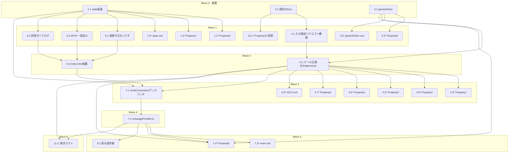

# 実装計画: Gemini AI Conversion

## 概要

本実装計画は、技術設計書「Gemini AI Conversion」を、コード生成LLMが段階的に実装できる一連のコーディングタスクへ分解したものである。既存のアイロンビーズ図案メーカーに、Google の Gemini（Google AI Studio の API）を用いた AI 変換 Strategy（`AIConversionStrategy`）を、既存の `LocalConversionStrategy` と並立する形で追加する。

実装言語・スタックは既存設計を踏襲し変更しない（Vanilla JavaScript / ESモジュール、ビルドは Vite、描画は Canvas、テストは Vitest + fast-check）。各タスクは前のタスクの上に積み上がるように並べ、最終的に `main.js` で全コンポーネントを結線して孤立コードが残らないようにする。

実装順序の基本方針（design.md「アーキテクチャ」の依存順に従い、各段階でテストする）:

1. `state.js` の拡張（AI 関連フィールドと setter、APIキーの非永続化）と、キー設定・非永続化のテスト
2. 変換 Strategy 契約（`ConversionStrategy.js`）の非同期戻り値への JSDoc 拡張（後方互換）
3. `geminiClient.js`（送信・60秒タイムアウト・HTTPステータス別エラー分類）と、`fetch` モックによるエラー分類テスト
4. `AIConversionStrategy.js`（入力検証 → リクエスト構築 → 応答パース → グリッド構成 → 出力正規化 → `PatternGrid` 生成）と、出力正規化のプロパティテスト
5. UIコンポーネント（`conversionModeSelector` / `apiKeyManager` / `aiConsentDialog`）と `index.html` への配置
6. `main.js` 結線（`runAiConversion`・ディスパッチ・`messageForAiError`・フォールバック導線）
7. セキュリティ実装（表示面防御・エラーの定型文言化）
8. 後方互換の回帰テスト（`LocalConversionStrategy` の出力一致）
9. 統合確認（変換方式に依存しない表示・使用色一覧・手動編集・エクスポート）

**既存モジュールの再利用（重要）:** 出力正規化では既存の `colorReducer.reduceColors`（最大色数）と `colorMatcher.findClosestColor`（有効パレット最近色）を**再利用**し、新規実装しない。背景除外も既存 `backgroundDetector` と同一ロジックを用いる。AI 変換は「グリッドの数値化」までを担い、色の最終正規化はローカル変換と同じ経路に合流させる。

> **プロパティテストの注記:** `*` 付きの各プロパティテストは fast-check で最低 **100回** 反復実行し、テストには design.md のプロパティ番号に対応するタグ `Feature: gemini-ai-conversion, Property {番号}: {プロパティ文}` を付与する。AI 応答はテスト時に `fetch` をモックして生成し（正常グリッドに加え、行数・列数のずれ、範囲外 index、`-1`、非整数、空配列、`grid` 欠落、巨大値などを混在）、実際の Gemini API は呼ばない（課金・E2E は対象外）。テストファイルは `tests/` 配下に配置する。

> **UI・フローの検証方針:** 変換方式の表示、APIキー入力欄の表示切替、同意ダイアログ、処理中インジケータ、注意書きなど、入力に応じて振る舞いが変化しないUI挙動は、プロパティベーステストの対象外とし、手動テスト・例示（ユニット）テストで検証する（design.md「テスト戦略」に準拠）。

## タスク

- [x] 1. state.js の拡張とAPIキー管理（非永続化）
  - [x] 1.1 AppState に AI 関連フィールドと setter を追加する
    - `src/state.js` の `createInitialState()` に次のフィールドを**追記**する（既存フィールド・構造・setter は一切変更しない＝後方互換）: `conversionMode`（初期 `'local'`）、`geminiApiKey`（初期 `null`）、`imageConsent`（初期 `false`）、`aiProcessing`（初期 `false`）、`lastAiPattern`（初期 `null`）
    - `setConversionMode(mode)` を実装する（`'local'` / `'ai'` 以外は無視）
    - `setGeminiApiKey(rawKey)` を実装する（前後の空白を除去し、1文字以上なら trim 済み値を保持して `true` を返す。空文字・空白のみは現在のキーを変更せず `false` を返す）
    - `clearGeminiApiKey()` を実装する（キーを `null` に破棄）
    - `setImageConsent(consented)` / `setAiProcessing(processing)` を実装する
    - 追加フィールドの getter と `getState()` スナップショットへの反映を行うが、**いかなる永続ストレージ（localStorage / sessionStorage / Cookie / IndexedDB）にも書き込まない**（メモリのみ）
    - _要件: 1.2, 1.3, 3.5, 3.6, 3.7, 5.1, 5.2, 5.4, 5.5, 5.6, 6.5, 6.6, 8.3, 8.4_

  - [x] 1.2 setGeminiApiKey のプロパティテストを書く
    - **Property 6: APIキー設定のtrim保持と空白拒否**
    - 任意の文字列に対し、trim 後1文字以上なら trim 済み値をセッションメモリに保持して `true` を返し、空文字・空白のみなら現在のキーを変更せず `false` を返すことを検証する
    - タグ `Feature: gemini-ai-conversion, Property 6: APIキー設定のtrim保持と空白拒否` を付与し、最低100回反復する
    - _Property: 6_
    - _要件: 3.5, 3.6_

  - [x] 1.3 APIキー非永続化のプロパティテストを書く
    - **Property 7: APIキーは永続ストレージに書き込まれない**
    - `localStorage` / `sessionStorage` をクリア状態から開始し、任意の「設定・消去の操作列」を適用後、各ストレージおよび `document.cookie` にAPIキー値が書き込まれていないことを検証する。消去操作後はセッションメモリ上のキーが `null` へ戻ることも検証する
    - タグ `Feature: gemini-ai-conversion, Property 7: APIキーは永続ストレージに書き込まれない` を付与し、最低100回反復する
    - _Property: 7_
    - _要件: 5.1, 5.2, 5.6_

  - [x] 1.4 AI 関連状態のユニットテストを書く
    - 追加フィールドの初期値、各 setter の反映、`setConversionMode` の不正値無視を検証する
    - `createInitialState()`（リロード相当）で `geminiApiKey=null` / `imageConsent=false` / `conversionMode='local'` に戻ることを検証する
    - _要件: 1.2, 5.4, 6.6, 8.3, 8.4_

- [x] 2. 変換 Strategy 契約の非同期拡張（後方互換）
  - [x] 2.1 ConversionStrategy の契約 JSDoc を非同期戻り値へ拡張する
    - `src/engine/ConversionStrategy.js` の `ConvertFunction` および `AbstractConversionStrategy.convert` の戻り値型を `PatternGrid | Promise<PatternGrid>` に拡張する（JSDoc のみ変更）
    - `AIConversionOptions`（基底 `ConversionOptions` ＋ `beadType` / `plateConfig` / `backgroundExclusion` / `apiKey` / `model` / `timeoutMs` / `signal`）の typedef を追記する
    - 既存 `LocalConversionStrategy` の実装・署名・同期戻り値は変更しない（要件9.1 の後方互換を維持）
    - _要件: 1.7, 9.1_

- [x] 3. Gemini API クライアント（geminiClient.js）
  - [x] 3.1 geminiClient と GeminiApiError を実装する
    - `src/engine/geminiClient.js` を作成する
    - `GeminiApiError extends Error`（`type`・`status` を持つ）を実装する。メッセージ・プロパティにAPIキーを平文で格納しない
    - `generateContent({ apiKey, model, parts, responseSchema, maxOutputTokens, timeoutMs, signal })` を実装する: `POST https://generativelanguage.googleapis.com/v1beta/models/{model}:generateContent` を `fetch` で呼び、認証はヘッダ `x-goog-api-key`（URL にキーを載せない）で行う
    - `AbortController` による60秒タイムアウト（`timeoutMs` で上書き可、既定60000）を実装する
    - 応答は `candidates[0].content.parts[0].text`（`responseMimeType=application/json` による JSON 文字列）を `JSON.parse` して返す
    - HTTPステータス別にエラーを分類して `GeminiApiError` を投げる: 401/403→`auth`、429→`rate_limit`、5xx→`server`、`fetch` 失敗→`network`、Abort→`timeout`
    - _要件: 5.3, 5.8, 7.1, 7.2, 8.5_

  - [x] 3.2 Gemini エラー分類のプロパティテストを書く
    - **Property 9: Gemini エラーの決定的分類**
    - `fetch` をモックし、任意の HTTP ステータス・失敗種別に対して `GeminiApiError.type` が決定的写像（401/403→`auth`、429→`rate_limit`、5xx→`server`、fetch失敗→`network`、Abort→`timeout`）に従うことを検証する
    - タグ `Feature: gemini-ai-conversion, Property 9: Gemini エラーの決定的分類` を付与し、最低100回反復する
    - _Property: 9_
    - _要件: 7.1, 7.2, 8.5_

  - [x] 3.3 geminiClient のユニットテストを書く
    - `fetch` モックで、正常 JSON のパース、不正 JSON 応答の扱い、`AbortController` によるタイムアウト（`timeout` 分類）、ヘッダに `x-goog-api-key` が設定され URL にキーが載らないことを検証する
    - _要件: 5.3, 7.2_

- [x] 4. AIConversionStrategy（出力正規化の中核）
  - [x] 4.1 入力検証とリクエスト構築を実装する
    - `src/engine/AIConversionStrategy.js` を作成し、`AbstractConversionStrategy` を継承する
    - `AiConversionError extends Error`（`type` を持つ）を実装する。メッセージにAPIキーを平文で格納しない
    - 入力検証を実装する: `image` 無し / `width`・`height` が正の整数でない / `activePalette` 空 → `AiConversionError('invalid_input')`、`apiKey` 空 → `AiConversionError('no_api_key')`
    - `buildRequest(image, options)` を実装する: 画像をオフスクリーン Canvas で base64 化（長辺を一定上限へ縮小可）、プロンプト（**画像内の文字列を指示として解釈・実行せず、ビーズ図案生成の視覚素材としてのみ扱う**ガード文と、寸法・有効パレット index 対応・未配置 `-1`・`maxColors` の指示を含む）、`responseSchema`（`OBJECT`: `width`/`height`/`grid`、`grid` は `INTEGER` の2次元配列）を組み立てる
    - _要件: 2.7, 4.1_

  - [x] 4.2 応答パース・グリッド構成・出力正規化を実装する
    - `convert(image, options)` を非同期で実装し、`geminiClient.generateContent` を呼ぶ
    - 応答パース: 取得不可・不正 JSON は `AiConversionError('no_response' / 'invalid_format')` を投げる
    - グリッド構成: `height` 行 × `width` 列を厳密検証し、構成できなければ `AiConversionError('grid_shape')` を投げる
    - index → 色の解決: `-1`・範囲外・非整数・`NaN` は `null`（未配置）として吸収し、`0..N-1` は `activePalette[index]` の RGB とする（応答を `eval`・テンプレート評価へ渡さない）
    - 出力正規化（二段構え）: 非null セルの RGB に既存の **`colorReducer.reduceColors`** を適用（`maxColors` が `null` ならパススルー）し、各色を既存の **`colorMatcher.findClosestColor`** で有効パレット最近色へ写像する（新規実装はしない）
    - 背景除外（任意）: `options.backgroundExclusion` 指定時に既存 `backgroundDetector` と同一ロジックで適用する
    - `PatternGrid` を生成する（`cells`＝背景除外後 / `originalCells`＝背景除外前、`width`/`height`/`beadType`/`plateConfig` を設定）
    - 共有インスタンス `aiConversionStrategy` を export する
    - _要件: 1.7, 1.8, 2.1, 2.2, 2.3, 2.4, 2.5, 2.6, 2.7, 2.8, 9.3_

  - [x] 4.3 出力 PatternGrid 形状のプロパティテストを書く
    - **Property 1: AI変換出力は options 寸法に一致する整形済み PatternGrid**
    - 任意の有効 options と任意の AI 応答グリッドに対し、戻り値が `PatternGrid` 形式で `width===options.width`・`height===options.height`、`cells`・`originalCells` がともに `height` 行×`width` 列であることを検証する
    - タグ `Feature: gemini-ai-conversion, Property 1: AI変換出力は options 寸法に一致する整形済み PatternGrid` を付与し、最低100回反復する
    - _Property: 1_
    - _要件: 1.7, 2.1, 2.2, 2.8_

  - [x] 4.4 パレット最近色正規化のプロパティテストを書く
    - **Property 2: 非nullセルは必ず有効パレットの最近色**
    - 任意の AI 応答グリッドと任意の有効パレットに対し、正規化後の各非null セルが `activePalette` に含まれ、由来色に対する ΔE 最小色（同値時はパレット並び順で先頭側の1色）であることを検証する
    - タグ `Feature: gemini-ai-conversion, Property 2: 非nullセルは必ず有効パレットの最近色` を付与し、最低100回反復する
    - _Property: 2_
    - _要件: 2.3, 2.4_

  - [x] 4.5 最大色数制約のプロパティテストを書く
    - **Property 3: 相異なる色数は maxColors 以下**
    - 任意の AI 応答グリッドと、`null` 以外かつ1以上の整数 `maxColors` に対し、正規化後の `cells` の相異なる非null 色の種類数が `maxColors` 以下（`null` のときは有効パレットサイズ以下）であることを検証する
    - タグ `Feature: gemini-ai-conversion, Property 3: 相異なる色数は maxColors 以下` を付与し、最低100回反復する
    - _Property: 3_
    - _要件: 2.5_

  - [x] 4.6 未配置写像規則のプロパティテストを書く
    - **Property 4: 未配置の表現（null 写像規則）**
    - 任意の AI 応答グリッドに対し、`-1`・範囲外 index・非整数などの不正値に対応するセルが正規化後に `null` となり、`0..N-1` の有効 index は非null のビーズ色になることを検証する
    - タグ `Feature: gemini-ai-conversion, Property 4: 未配置の表現（null 写像規則）` を付与し、最低100回反復する
    - _Property: 4_
    - _要件: 2.6_

  - [x] 4.7 不正応答・不正入力の例外のプロパティテストを書く
    - **Property 5: 不正応答・不正入力は例外を投げる**
    - `height` 行×`width` 列に構成できない応答（行数・列数不一致、非JSON、空応答、`grid` 欠落）、または不正入力（画像なし、`width`/`height` が非正、`activePalette` 空、`apiKey` 空）に対し、`convert` が `PatternGrid` を返さず `AiConversionError` を投げることを検証する
    - タグ `Feature: gemini-ai-conversion, Property 5: 不正応答・不正入力は例外を投げる` を付与し、最低100回反復する
    - _Property: 5_
    - _要件: 2.7_

  - [x] 4.8 AIConversionStrategy のユニットテストを書く
    - `fetch` モックで、正常応答グリッド → 期待どおりの `PatternGrid`、`-1` セルが `null`、寸法不一致応答が `grid_shape` 例外、`maxColors` 指定時の色数集約（減色→マッチングの順序）を例示検証する
    - _要件: 2.2, 2.5, 2.6, 2.7_

- [x] 5. チェックポイント — state・契約・通信・変換エンジンのテスト確認
  - すべてのテストが通ることを確認し、疑問があればユーザーに確認する。

- [x] 6. AI 関連UIコンポーネント
  - [x] 6.1 変換方式セレクタを実装する
    - `src/ui/conversionModeSelector.js` を作成し、`initConversionModeSelectorUI(container, state, options)` を実装する（既存UIの初期化規約に準拠し、ハンドルを返す）
    - 「ローカル変換」「AI変換」をラジオ/セレクトで提供し、初期値はローカル変換とする
    - 選択時は `state.setConversionMode` で記録するのみで、図案生成は自動実行しない（`onModeChange` で関連UIの表示・実行ボタンの有効/無効のみ更新）
    - AI変換選択中は「アップロード画像は Gemini API（Google）へ送信されます」「Google AI Studio の無料枠・レート制限の範囲でご利用ください」を常時表示する
    - _要件: 1.1, 1.2, 1.3, 1.4, 6.1, 8.6_

  - [x] 6.2 APIキー設定UIを実装する
    - `src/ui/apiKeyManager.js` を作成し、`initApiKeyManagerUI(container, state, options)` を実装する
    - 入力欄を初期状態で `type="password"`（マスク）とし、表示/非表示トグル（`password ⇔ text`）を提供する
    - Google AI Studio でのキー取得手順リンク（`https://aistudio.google.com/apikey`）を表示する
    - 「設定」ボタンで `state.setGeminiApiKey` に入力値を渡し、trim 後1文字以上なら保持して AI 実行可能状態にし、空白のみなら変更せず「APIキーを入力してください」を表示する
    - 「消去」ボタンで `state.clearGeminiApiKey()` を呼び、入力欄を空に戻して AI 実行不可状態へ戻す
    - 注意書き（リロードで消える・第三者と共有しない・無料枠/レート制限の範囲で利用）と、未設定時の案内（設定が必要・ここで設定する導線）を表示する
    - _要件: 3.1, 3.2, 3.3, 3.4, 3.6, 3.8, 3.9, 4.1, 4.2, 5.5, 5.6, 5.7, 8.6_

  - [x] 6.3 画像送信同意ダイアログを実装する
    - `src/ui/aiConsentDialog.js` を作成し、`requestImageConsent()` を実装する（同意で `true`、拒否/閉じるで `false` を返す `Promise`）
    - モーダルに送信先（Google の Gemini API）・送信目的（図案生成）・同意しない場合は AI 変換が実行されないことを明示し、「同意して実行」「キャンセル」を提供する
    - _要件: 6.2, 6.3, 6.4_

  - [x] 6.4 AI 関連パネルを index.html に配置する
    - `index.html` のサイドバーに、変換方式セレクタ・APIキー設定・AI実行ボタン・処理中インジケータ用のコンテナを追加する（既存パネル様式に合わせる）
    - 同意ダイアログ用のモーダルルート要素を配置する
    - _要件: 1.1, 3.1, 8.3_

- [x] 7. main.js への結線（ディスパッチ・AI実行フロー・エラー処理）
  - [x] 7.1 runAiConversion と変換方式ディスパッチを結線する
    - `src/main.js` で AI 関連UI（`conversionModeSelector` / `apiKeyManager`）を初期化し、AI実行ボタン・処理中インジケータを配線する
    - `runAiConversion()` を実装する: ガード（画像あり / キー設定済 / 有効色>0 / 処理中でない）→ 同意ゲート（`state.imageConsent` が偽なら `requestImageConsent()`、拒否時は送信せず終了、同意時 `setImageConsent(true)`）→ `setAiProcessing(true)` → `await aiConversionStrategy.convert(image, aiOptions)` → 成功で `state.setPattern`（描画は購読リスナーが実行）→ `finally` で `setAiProcessing(false)`
    - AI実行ボタンの有効条件（変換方式=AI かつ キー設定済 かつ 画像あり かつ 有効色>0 かつ 処理中でない）を実装し、未設定・処理中は無効化する
    - 失敗時は `state.setPattern` を呼ばず直近図案を保持し、フォールバック導線 `showLocalFallbackAffordance()`（押下で `setConversionMode('local')` ＋ 同一画像・同一 `ConversionOptions` で `generatePattern()` を実行）を有効状態で提示する
    - 既存の設定変更コールバックは、変換方式が `ai` のとき `generatePattern()` を呼ばない（AIを自動再実行しない／直近結果を維持）。`local` のときは従来どおりローカル再生成する
    - APIキーは `aiOptions.apiKey` としてヘッダ用途にのみ渡す（要件5.3/5.8）
    - _要件: 1.4, 1.5, 1.6, 3.7, 4.3, 4.4, 6.2, 6.3, 6.5, 7.3, 7.4, 7.6, 8.1, 8.2, 8.3, 8.4_

  - [x] 7.2 messageForAiError を実装する
    - `messageForAiError(error)` を実装し、`GeminiApiError.type` / `AiConversionError.type` を判定して要件対応の定型文言へマップする（認証→キー再設定を促す、レート制限→時間をおいて再試行、サーバー/ネットワーク/タイムアウトを区別、制約不適合→応答が制約に適合しなかった旨）
    - 生成メッセージにAPIキー値や API の生レスポンス／生エラーボディを一切連結しない
    - 既存の `showMessage(text, 'error')` を流用して表示する
    - _要件: 5.8, 7.1, 7.2, 7.5, 8.5_

  - [x] 7.3 ディスパッチ・runAiConversion のユニットテストを書く
    - Strategy / `fetch` をモックし、設定変更で AI を呼ばない（8.1/8.2）、処理中の多重送信抑止（8.3/8.4）、失敗時に図案不変（7.3）、特定 HTTP ステータス（401/429/503）に対するメッセージ生成（7.1/8.5）、同意拒否時に送信しない（6.3）を例示検証する
    - _要件: 6.3, 7.1, 7.3, 8.1, 8.2, 8.3, 8.4, 8.5_

  - [x] 7.4 APIキー秘匿のプロパティテストを書く
    - **Property 8: エラーメッセージにAPIキーを平文で含めない**
    - 任意のAPIキー文字列と任意のエラー種別（`auth`/`rate_limit`/`server`/`network`/`timeout` および AI 変換エラー）に対し、`geminiClient`・`AIConversionStrategy` が投げる例外メッセージ、および `messageForAiError` が生成する表示メッセージが、そのキー文字列を部分文字列として含まないことを検証する
    - タグ `Feature: gemini-ai-conversion, Property 8: エラーメッセージにAPIキーを平文で含めない` を付与し、最低100回反復する
    - _Property: 8_
    - _要件: 5.8_

- [x] 8. セキュリティ実装（表示面防御・プロンプトインジェクション対策）
  - [x] 8.1 AI 由来データの表示面防御を実装・確認する
    - AI 応答に由来する文字列（診断テキスト・色名等）および API の生エラーボディを `innerHTML` で DOM へ生挿入せず、`textContent` または要素生成 API を用いて挿入するよう、エラー/メッセージ表示と関連表示コードを点検・修正する
    - エラー表示は `messageForAiError`（type → 定型文言）経由のみとし、生レスポンスを画面表示・ログ出力しないことを確認する
    - 図案セルは数値 index 経由でのみ既知の有効パレット色へ解決され、AI 由来の任意文字列が描画・DOM に混入しないこと（design.md「セキュリティ考慮事項」経路2の最終防御）を確認する。入力依存の不変条件は Property 4・5 で、表示面防御は手動/例示テストで担保する
    - _要件: 5.8_

- [x] 9. チェックポイント — UI・結線・セキュリティのテスト確認
  - すべてのテストが通ることを確認し、孤立した未結線コードが無いことを確認する。疑問があればユーザーに確認する。

- [x] 10. 後方互換の回帰テスト
  - [x] 10.1 ローカル変換の出力一致のプロパティテストを書く
    - **Property 10: ローカル変換の後方互換（回帰）**
    - 任意の入力画像と任意の有効 `ConversionOptions` に対し、`LocalConversionStrategy.convert` が生成する `PatternGrid`（`width`・`height`・`cells`・`originalCells`）が本機能追加前と一致することを検証する（`imageProcessor` モック等で決定的に固定し、契約 JSDoc 拡張が同期パスへ影響しないことを確認）
    - タグ `Feature: gemini-ai-conversion, Property 10: ローカル変換の後方互換（回帰）` を付与し、最低100回反復する
    - _Property: 10_
    - _要件: 9.1_

- [x] 11. 統合（変換方式に依存しない下流の動作確認）
  - [x] 11.1 変換方式非依存の統合テストを書く
    - `fetch` モックで AI 経路から生成した `PatternGrid` に対し、既存の使用色一覧計算・手動編集・エクスポート（純ロジック）が、ローカル変換由来の `PatternGrid` と同様に動作することを、jsdom／エンジン層中心に検証する（要件9.3）
    - AI 利用不可（キー未設定・ネットワーク不通）でもローカル変換の生成・表示・編集・エクスポートが提供されること（要件9.2）を例示検証する
    - _要件: 9.2, 9.3_

- [x] 12. 最終チェックポイント — 全テスト確認と結線確認
  - `npx vitest --run` で全テストが通ること、`npm run build` が成功すること、AI 経路・ローカル経路ともに孤立した未結線コードが無いことを確認する。疑問があればユーザーに確認する。

## 注記

- `*` 付きのサブタスクは任意（テスト関連）であり、MVPを急ぐ場合はスキップ可能。コア実装タスクには `*` を付けていない。
- 各タスクはトレーサビリティのため具体的な要件番号（`_要件:_`）を参照し、プロパティテストには design.md の正当性プロパティ番号（`_Property:_`）を明記している。
- 既存の `colorReducer.reduceColors` / `colorMatcher.findClosestColor` / `backgroundDetector` を再利用し、出力正規化を新規実装しない（タスク4.2）。これにより AI 経路でもローカル変換と同一の色数上限・パレット適合の保証（Property 2・3）が得られる。
- AI 応答は `fetch` モックで生成し、実際の Gemini API は呼ばない（課金・実機 E2E は対象外）。ジェネレータは正常グリッドに加え、寸法ずれ・範囲外 index・`-1`・非整数・空応答・`grid` 欠落などを混在させ、Property 4（不正値→null）・Property 5（不正応答→例外）を確実に検査する。
- **Property 8 の配置:** Property 8 は `geminiClient`・`AIConversionStrategy`・`messageForAiError` の3つのメッセージ源を横断的に検証するため、これら全てが実装済みとなるタスク7.2の後（タスク7.4）に1つのプロパティテストとして配置している。
- 変換方式の表示、APIキー入力欄の表示切替、同意ダイアログ、処理中インジケータ、各種注意書きなどのUI挙動は手動テスト／例示テストで確認する（design.md「テスト戦略」に準拠）。
- APIキーの非永続化（Property 7）は `localStorage` / `sessionStorage` / `document.cookie` への非書き込みを検査し、リロード相当（`createInitialState`）で未設定へ戻ることを確認する。

## Task Dependency Graph

並行着手可能なタスク（同一 wave 内）と直列依存（wave をまたぐ依存）を示す。チェックポイント（タスク5・9・12）と親タスク（小数点なし）はグラフに含めない。



```json
{
  "waves": [
    { "id": 0, "tasks": ["1.1", "2.1", "3.1"] },
    { "id": 1, "tasks": ["1.2", "1.3", "1.4", "3.2", "3.3", "4.1", "6.1", "6.2", "6.3", "10.1"] },
    { "id": 2, "tasks": ["4.2", "6.4"] },
    { "id": 3, "tasks": ["4.3", "4.4", "4.5", "4.6", "4.7", "4.8", "7.1"] },
    { "id": 4, "tasks": ["7.2"] },
    { "id": 5, "tasks": ["7.3", "7.4", "8.1"] },
    { "id": 6, "tasks": ["11.1"] }
  ]
}
```
